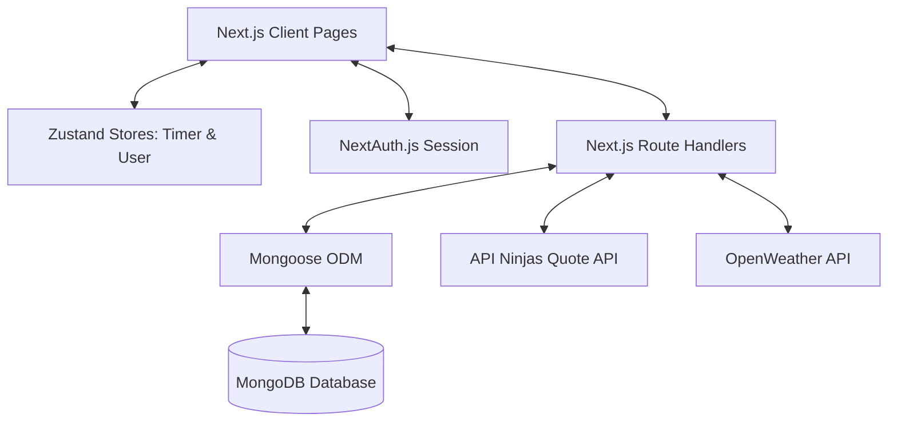

# Daily Dock

Daily Dock is a modern, premium, and unified personal productivity dashboard and workspace. It integrates a Pomodoro timer, Kanban todo board, daily journaling, note-taking, real-time weather information, and login streak tracking into a single, cohesive experience.

---

## 🛠️ Technology Stack

| Layer | Technology |
| :--- | :--- |
| **Framework** | Next.js (v16 App Router) & React 19 |
| **Styling** | Tailwind CSS (v4) with custom CSS Variables & CSS Animations |
| **State Management** | Zustand (with multi-tab synchronization & MongoDB state persistence) |
| **Authentication** | NextAuth.js (supporting Google, Microsoft Azure AD, & credentials login) |
| **Database** | MongoDB with Mongoose ODM |
| **Task Drag & Drop** | `@dnd-kit/core` & `@dnd-kit/utilities` |

---

## 🎯 Features & Productivity Benefits

### 🌟 Dashboard Home (The Daily Cockpit)
* **Purpose**: Serves as the central command center for your morning routine, providing cognitive priming and environment awareness.
* **Greeting & Streak Tracker**: Boosts daily discipline and builds long-term consistency by gamifying logins and visualizing active streaks.
* **Daily Quote**: Combats early morning fatigue and provides focus-oriented inspiration.
* **Dynamic Weather & Sun/Moon Tracking**: Provides ambient outdoor updates (sunrise/sunset, wind direction, humidity, pressure, visibility) to help you plan screen-breaks, walk intervals, or adjust workspace lighting.

### 📅 Diary (Journaling & Reflection)
* **Purpose**: Encourages daily mindfulness, progress logging, and emotional grounding to reduce workplace stress.
* **Debounced Autosave**: Zero-friction writing experience that auto-saves your thoughts in the background, eliminating the risk of data loss.
* **Title-based Sidebar with pin feature**: See what you've written earlier. Sort and find them. and continue where you left off. And pin the most important ones to the top.
* **Character Metrics**: Offers visual feedback on daily journaling milestones.
* **Date Picker**: Allows you to modify the date when you wrote the diary.


### 📋 Todo Board (Kanban Task Orchestration)
* **Purpose**: Reduces cognitive load by mapping your work in 3 categories: `Not Started`, `In Progress`, and `Completed`.
* **Drag-and-Drop Workflow**: Simply drag tasks across the 3 statuses to track progression.
* **Inline Edits & Instant Trashing**: Reduces interface friction so logging, editing, or discarding a task takes under 2 seconds.
* **Interference Shield**: Integrated drag constraints prevent accidental drag-and-drop triggers when you click items on high-sensitivity pointers or touch devices.

### 📝 Notes Workspace (Knowledge & Scratchpad)
* **Purpose**: A context-free scratchpad for capturing fleeting thoughts, reference material, code snippets, or project outlines.
* **Category Tagging**: Easily organize and filter notes under `travel`, `productivity`, `study`, or `fun` tags.
* **Pinned Collections**: Keep critical reference documents, checklists, or credentials fixed at the top of your workspace.
* **Distraction-Free Editor**: Immersive typography and layout optimized for long-form brain-dump sessions.

### ⏱️ Pomodoro Timer (Focus Blocks & Breaks)
* **Purpose**: Sustains high levels of deep work and prevents cognitive burnout using structured focus intervals and rest phases.
* **State Sync Across Tabs**: Synchronizes the ticking timer automatically across all open browser tabs using `zustand-sync-tabs` to prevent multiple countdown processes or audio triggers.
* **Database Session Persistence**: Backs up your active session state to MongoDB so you can pause a focus block on one device and resume it seamlessly on another.
* **Tailored Focus Cycles**: Easily configure total sessions, focus blocks, and break durations to align with your personal energy cycles.
* **Timer History**: Shows completed timer sessions with the date, time, and duration of each session. Helps you track your productivity over time.

---

## 🏗️ Architecture Flow



---

## 📁 Project Structure
```
daily-dock/
├── app/                         # STRICTLY FOR ROUTING & PAGE INITS
│   ├── api/                     # Backend API Route Handlers
│   │   ├── auth/                # NextAuth API endpoints
│   │   └── dock/                # Dock API endpoints
│   │       └── note/                # Note API endpoints
│   │       └── todo/                # Todo API endpoints
│   │       └── timer/               # Timer API endpoints
│   │   └── user/                # User API endpoints
│   ├── about/
│   │   └── page.tsx
│   ├── diary/
│   │   └── page.tsx
│   ├── login/
│   │   └── page.tsx
│   ├── note/
│   │   └── page.tsx
│   ├── register/
│   │   └── page.tsx
│   ├── timer/
│   │   └── page.tsx
│   ├── todo/
│   │   └── page.tsx
│   ├── favicon.ico
│   ├── globals.css
│   ├── layout.tsx
│   └── page.tsx
│
├── components/                  # UNIFIED UI COMPONENTS
│   ├── ui/                      # shadcn/ui primitives (Button, Card, Dialog, etc.)
│   │   └── card.tsx
│   ├── layout/                  # Global layout elements
│   │   ├── Header.tsx
│   │   ├── Hero.tsx
│   │   ├── LandingPage.tsx
│   │   ├── Footer.tsx
│   │   └── SessionWrapper.tsx
│   └── feedback/                # Feedback & Status indicators
│       ├── LoadingSpinner.tsx
│       └── SendNotification.tsx
│
├── features/                    # FEATURE-SPECIFIC MODULES (State, Components, Logic)
│   ├── diary/
│   │   ├── DiaryDatePicker.tsx
│   │   ├── DiaryEditor.tsx 
│   │   └── DiarySidebar.tsx
│   ├── todo/
│   │   ├── TodoContainer.tsx
│   ├── note/
│   │   └── NoteEditor.tsx
│   ├── timer/
│   │   └── TimerStatus.tsx
│   |── weather/
│   |   └── Weather.tsx
│   |   └── handler/           
│   |       └── weather.ts
│   └── quote/
│       └── Quote.tsx
│       └── handler/           
│           └── quote.ts
│
├── lib/                         # SHARED UTILITIES & CENTRAL CLIENTS
│   ├── auth.ts                 
│   └── db.ts                    
│
├── models/                      # DATABASE SCHEMAS (MONGOOSE)
│   ├── Diary.ts
│   ├── Note.ts
│   ├── Timer.ts
│   ├── Todo.ts
│   └── User.ts
│
├── stores/                      # STATE MANAGEMENT (ZUSTAND STORES)
│   ├── timerStore.ts            
│   └── userStore.ts             
│
├── types/                       # GLOBAL TYPES & INTERFACES
│   ├── diary.ts
│   ├── note.ts
│   ├── timer.ts
│   ├── todo.ts
│   └── user.ts
```

## ⚙️ Configuration & Environment Variables

Copy `.env.example` to create your local environment file:


Populate the `.env` file with your credentials:

```env
# Database Connection
MONGO_URI=your_mongodb_connection_uri

# NextAuth Settings
NEXTAUTH_SECRET=your_nextauth_jwt_secret

# OAuth Credentials
GOOGLE_CLIENT_ID=google_oauth_client_id
GOOGLE_CLIENT_SECRET=google_oauth_client_secret

AZURE_AD_CLIENT_ID=azure_ad_client_id
AZURE_AD_CLIENT_SECRET=azure_ad_client_secret
AZURE_AD_TENANT_ID=azure_ad_tenant_id

# Public API Keys
NEXT_PUBLIC_QUOTES=api_ninjas_secret_key
NEXT_PUBLIC_WEATHER=open_weather_map_api_key
```

---

## 🚀 Getting Started

### 1. Prerequisites
* **Node.js** `v18.x` or higher.
* An active **MongoDB** database instance.

### 2. Installation
Install project dependencies:
```bash
npm install
```

### 3. Running in Development
Start the local development server:
```bash
npm run dev
```
Open `http://localhost:3000` in your browser.

### 4. Build for Production
Create an optimized production build:
```bash
npm run build
npm run start
```
